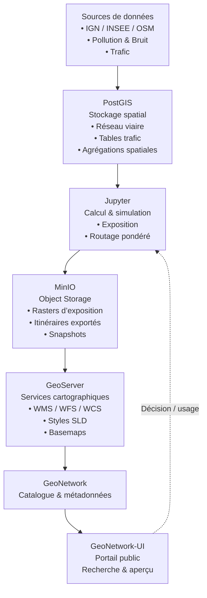

---
{"dg-publish":true,"permalink":"/1-projets/elasticlabs-cours/2026-ho-l-sdi-avec-docker-ensg/j2-conteneurisation-and-reverse-proxy/lab-01-mise-en-route/","tags":["gardenEntry"],"noteIcon":""}
---


Bienvenue dans cette série de cours sur la conception d'Infrastructures de Données Géospatiales sous forme de micro services. 

## Architecture finale visée 


Listez les COTS employés par catégorie : 
 - Coeur de métier
 - Services de socle
 - Service de support
 - Services de données

## Architecture de données visée 



## Configuration du lab

Sur votre machine, assurez-vous d'avoir installé les applications suivantes : 
- Chromium
- VSCode

### Dépôt github

Créez un dépôt github dédié à l'application. 

Créez un token applicatif et conservez-le précieusement, il vous sera très utile pour la gestion de vos fichiers par la suite! RDV à l'URL [GitHub tokens](https://github.com/settings/tokens) de votre compte Github. 

Créez un repository public (par exemple `ensg-sdi-2025`) contenant un fichier README.md et un fichier de licence MIT. 

### Création du répertoire racine de vos applications

Sur votre machine, naviguez à la racine de votre espace de fichiers personnel, et créez le dossier ``~/Apps`` destiné à contenir les clones de vos dépôts GIT. 

### Configuration de VSCode

L'éditeur de code VSCode est l'outil de référence, gratuit, pour la majorité des développeurs du monde entier depuis de nombreuses années. 

Configurez l'outil VSCode simplement, en intégrant GitHub : https://code.visualstudio.com/docs/sourcecontrol/intro-to-git

Clonez votre repository github avec la commande VSCode "CTRL + P suivi de git : clone", et ajoutez son répertoire de stockage à l'espace de travail VSCode. 

- [i] Après avoir ajouté votre dépôt initial, effectuez une modification du fichier ``README.md`` et faites un ``commit`` puis un ``push`` pour valider la configuration.


## Mise en oeuvre de Docker

**Docker** est un ensemble de produits PaaS (plateforme en tant que service) qui utilisent la virtualisation au niveau du système d'exploitation pour fournir des logiciels dans des packages appelés conteneurs. Les conteneurs sont isolés les uns des autres et regroupent leurs propres logiciels, bibliothèques et fichiers de configuration ; ils peuvent communiquer entre eux via des canaux bien définis. Tous les conteneurs sont gérés par un seul noyau de système d'exploitation et utilisent donc moins de ressources que les machines virtuelles — [Source](https://en.wikipedia.org/wiki/Docker_(software))


La conteneurisation présente plusieurs avantages, notamment les suivants :
- Plusieurs conteneurs peuvent s'exécuter sur la même machine et chaque conteneur dans un processus isolé.
- Les conteneurs prennent moins de place que les VM.
- Vous pouvez exécuter des conteneurs en quelques minutes, avec moins de mémoire car ils n'ont pas besoin du système d'exploitation complet.
- Nous pouvons déployer et tester des conteneurs partout.

### Installation 

L'installation de docker est très intuitive pour tout utilisateur de systèmes UNIX / Linux, et très bien documentée. 

RDV sur le site de l'éditeur : https://docs.docker.com/engine/install/ubuntu/
- Section  [Install using the `apt` repository](https://docs.docker.com/engine/install/ubuntu/#install-using-the-repository)
- Très important, ne pas oublier de dérouler les étapes de post-installation de docker! 
	- https://docs.docker.com/engine/install/linux-postinstall/

### Mise en route de Docker

```bash
docker version
docker info
docker ps
```

✅ Attendu : Docker répond, et `docker ps` liste 0 ou quelques conteneurs.

**Créer un réseau Docker dédié (5 minutes)**
On crée un réseau pour que nos services puissent se parler proprement.

```bash 
docker network create exposome-net
docker network ls | grep exposome-net
```

✅ Attendu : `exposome-net` apparaît.

**Lancer Portainer**

- Créer un volume Portainer

```bash
docker volume create portainer_data
docker volume ls | grep portainer_data
```

- Lancer Portainer

```bash
docker run -d \
  --name portainer \
  --network exposome-net \
  -p 9000:9000 \
  -v /var/run/docker.sock:/var/run/docker.sock \
  -v portainer_data:/data \
  --restart unless-stopped \
  portainer/portainer-ce:latest
```

✅ Ouvrir : `http://localhost:9000`  
Créer un compte admin Portainer (local).

💬 Discussion (avec enseignant)
- Pourquoi monter `/var/run/docker.sock` ?
- Qu’est-ce que ça donne comme “pouvoir” à Portainer ?

**Préparer un dossier de données (base du fil rouge)**

Dans `~/exposome-lab/data`, créer :

```bash
echo "Dataset placeholder" > ~/exposome-lab/data/README.txt
mkdir -p ~/exposome-lab/data/{raw,processed,metadata}
```

✅ Attendu : un dossier “data” clair et déjà structuré.

💬 Discussion
- différence entre **raw** et **processed**
- “où vivent les données” par rapport aux conteneurs

**Lancer Filebrowser** : 

Créez un volume 

```bash
docker volume create filebrowser_db
```

Lancer le conteneur avec montage du dossier data

```bash
docker run -d \
  --name filebrowser \
  --network exposome-net \
  -p 8088:80 \
  -v ~/exposome-lab/data:/srv \
  -v filebrowser_db:/database \
  --restart unless-stopped \
  filebrowser/filebrowser:latest
```

✅ Ouvrir : `http://localhost:8088`  
Identifiants par défaut (souvent) : `admin` / `admin`  
➡️ Si ça ne marche pas, regarder les logs (certaines versions changent le bootstrap).

💬 Discussion
- bind mount : on voit les fichiers du PC
- volume : la base Filebrowser persiste

### Manipulations Docker “essentielles”

**Inspecter les conteneurs**

```bash
docker inspect portainer | head -n 30
docker inspect filebrowser | head -n 30
```

Questions :
- quels ports ?
- quels volumes ?
- quel réseau ?

**Entrer dans un conteneur**

```bash
docker exec -it filebrowser sh
ls -la /srv
exit
```

**Réseaux : vérifier la communication**

```bash
docker network inspect exposome-net | head -n 60
```

### Exercice rapide : “casser / réparer”

**Stop / Start**

```bash
docker stop filebrowser
docker ps
docker start filebrowser
docker ps
```

**Supprimer / recréer (sans perdre data)**

```bash
docker rm -f filebrowser
docker run -d \
  --name filebrowser \
  --network exposome-net \
  -p 8088:80 \
  -v ~/exposome-lab/data:/srv \
  -v filebrowser_db:/database \
  --restart unless-stopped \
  filebrowser/filebrowser:latest
```

✅ Vérifier : les fichiers dans `/srv` sont toujours là.

💬 Discussion
- conteneur jetable
- data persistante (bind mount + volume)

### Utiliser Portainer pour "Voir ce que l'on fait"

Dans Portainer :

- containers : start/stop/logs
- networks : `exposome-net`
- volumes : `portainer_data`, `filebrowser_db`
- images : `portainer/portainer-ce`, `filebrowser/filebrowser`

Exercice :

- redémarrer Filebrowser depuis Portainer
- consulter les logs Portainer

## ✅ Livrables attendus

- Portainer accessible : `http://localhost:9000`
- Filebrowser accessible : `http://localhost:8088`
- Réseau `exposome-net` créé
- Dossier `~/exposome-lab/data` structuré et monté dans Filebrowser

### Nettoyage (facultatif)

```bash
docker rm -f portainer filebrowser
docker volume rm portainer_data filebrowser_db
docker network rm exposome-net
```
